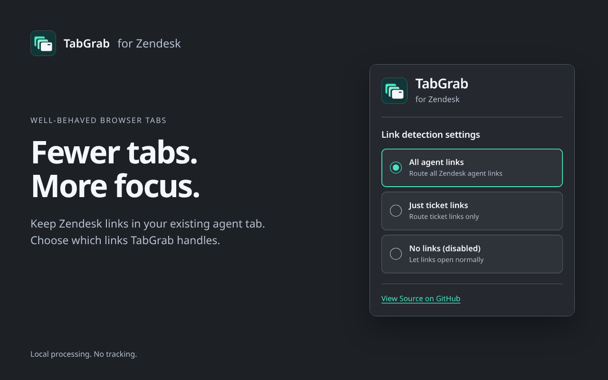

# Zendesk TabGrab


[](LICENSE)

**Fewer tabs. More focus.**

TabGrab opens supported Zendesk links in your existing agent tab, focuses it, and closes the duplicate tab.



## Install

[Chrome Web Store](https://chromewebstore.google.com/detail/zendesk-quicktab/fjoifbimocbapgodjieaecipndjciopm) · [Firefox Add-ons](https://addons.mozilla.org/en-US/firefox/addon/zendesk-tabgrab)

Open the toolbar popup to choose a mode:

| Mode | Behavior |
| --- | --- |
| All agent links | Route supported agent and ticket links to your existing agent tab. |
| Just ticket links | Route supported ticket links only. |
| No links (disabled) | Let links open normally. |

TabGrab leaves restricted chat, voice, talk, admin voice, ticket-print, and original-email routes alone. It handles `*.zendesk.com` URLs locally, stores your preferences in your browser, and has no analytics or tracking. See the [privacy policy](PRIVACY.md).

## Build and test locally

Requires Node.js **20.9+**.

```sh
git clone https://github.com/zachvivier/TabGrab.git
cd TabGrab
npm ci
npm test
npm run build:chrome
npm run build:firefox
```

- **Chrome:** Open `chrome://extensions`, enable **Developer mode**, choose **Load unpacked**, and select `dist/chrome`.
- **Firefox:** Open `about:debugging#/runtime/this-firefox`, choose **Load Temporary Add-on**, and select `dist/firefox/manifest.json`. The temporary installation lasts until Firefox restarts.

Disable any installed copy while testing. Check all three modes, saved selections, ticket routing, and excluded routes in both browsers. See [UI testing notes](UI-REFRESH.md) for the full checklist and verification limits.

For watch mode, run `npm run dev` (Chrome) or `npm run dev:firefox`. Run `npm audit --audit-level=high` before release; known build-tool findings are documented in the testing notes.

## What's new in 2.2.1

Neutral slate UI, clearer mode descriptions, refreshed toolbar icons, and visible keyboard focus. Routing behavior and permissions are unchanged.

[Changelog](CHANGELOG.md) · [Listing artwork](store-assets/README.md) · [Report an issue](https://github.com/zachvivier/TabGrab/issues)

Maintained by [zach](https://github.com/zachvivier). [Apache-2.0 license](LICENSE).
